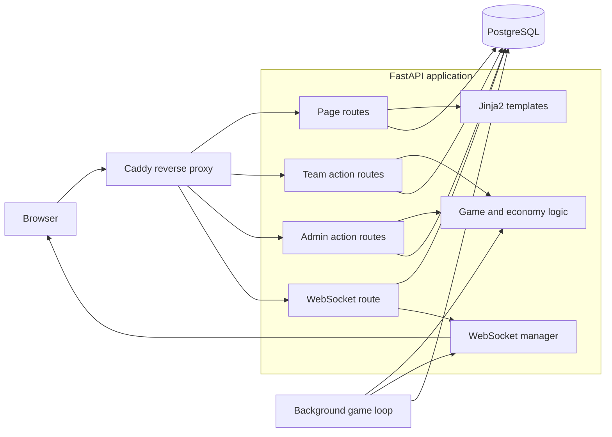
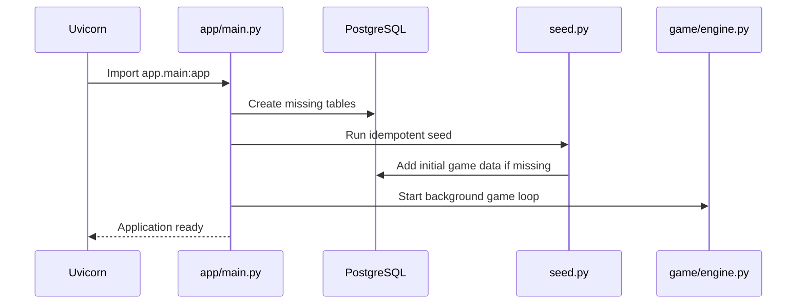
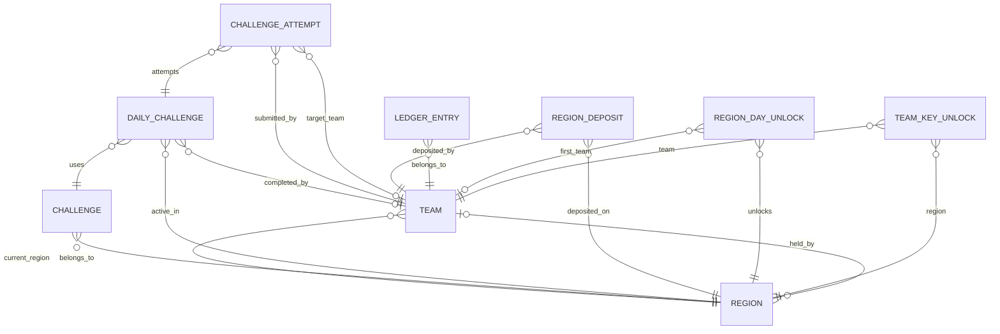
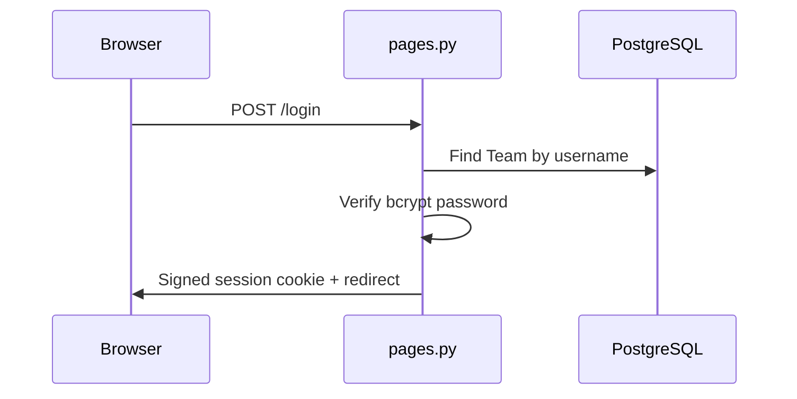
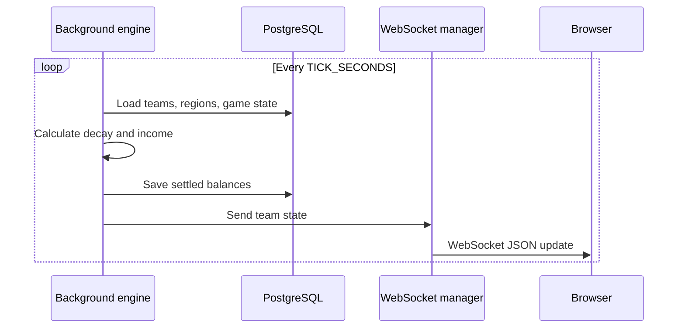
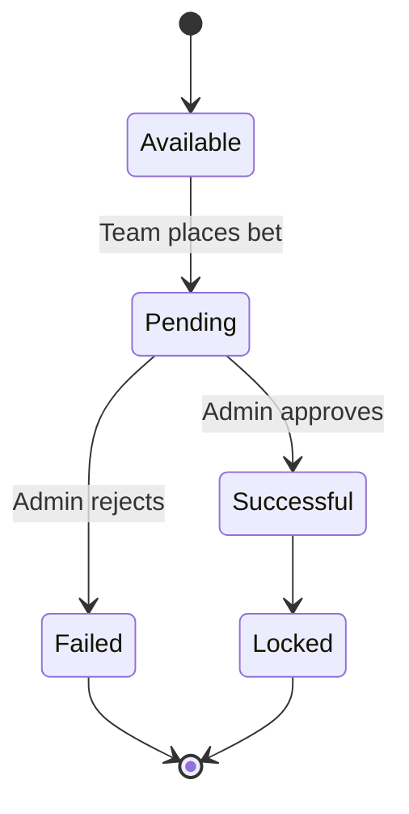
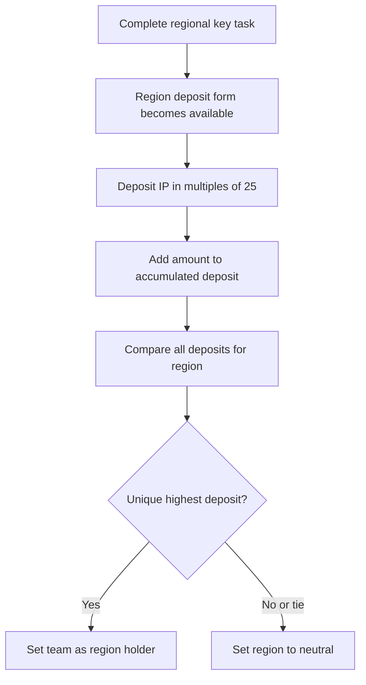

# San Andrejsala — Developer Documentation

This document explains how the project is structured, how the main components communicate, and where to make common changes.

It is intended for developers who are opening the codebase for the first time.

---

## 1. Project overview

**San Andrejsala** is a real-time web application for an in-person strategy game played across Latvia's regions.

Teams:

- log in through a browser;
- select their current region;
- earn and lose Influence Points (IP);
- complete regional key tasks;
- bet IP on daily challenges;
- deposit IP to capture regions;
- receive passive income from captured regions;
- see their balance update live.

Administrators:

- start or pause the game;
- advance the game day;
- adjust team balances;
- change team regions;
- create and assign challenges;
- approve or reject challenge attempts.

The application uses server-rendered HTML and a small amount of JavaScript. Most business logic is implemented in Python.

---

## 2. Technology stack

| Layer | Technology | Purpose |
|---|---|---|
| Web framework | FastAPI | HTTP routes, forms, dependencies, WebSockets |
| Application server | Uvicorn | Runs the FastAPI application |
| Database | PostgreSQL 16 | Stores teams, regions, challenges, balances, and game state |
| ORM | SQLAlchemy 2.0 async | Database models and asynchronous queries |
| PostgreSQL driver | asyncpg | Async connection between SQLAlchemy and PostgreSQL |
| Templates | Jinja2 | Server-rendered pages |
| Frontend | HTML, CSS, vanilla JavaScript | User interface and live balance display |
| Authentication | SessionMiddleware + bcrypt | Cookie sessions and password hashing |
| Migrations | Alembic | Database migration support |
| Reverse proxy | Caddy | Production HTTP/HTTPS and WebSocket proxying |
| Containers | Docker Compose | Runs the application, database, and production proxy |

---

## 3. High-level architecture



### Main idea

The code is divided into four main responsibilities:

1. **Routers** receive browser requests.
2. **Game modules** contain reusable economy and region logic.
3. **SQLAlchemy models** define the database structure.
4. **Templates and static files** render the interface and update it live.

---

## 4. Repository structure

```text
San_Andrejsala/
├── app/
│   ├── game/
│   │   ├── economy.py
│   │   ├── engine.py
│   │   ├── regions.py
│   │   └── taxes.py
│   │
│   ├── routers/
│   │   ├── admin.py
│   │   ├── api.py
│   │   ├── pages.py
│   │   └── ws.py
│   │
│   ├── static/
│   │   ├── app.js
│   │   └── style.css
│   │
│   ├── templates/
│   │   ├── admin.html
│   │   ├── base.html
│   │   ├── dashboard.html
│   │   └── login.html
│   │
│   ├── config.py
│   ├── database.py
│   ├── deps.py
│   ├── main.py
│   ├── models.py
│   ├── security.py
│   ├── seed.py
│   └── ws_manager.py
│
├── migrations/
│   ├── versions/
│   ├── env.py
│   └── script.py.mako
│
├── .env.example
├── alembic.ini
├── Caddyfile
├── deploy.sh
├── docker-compose.prod.yml
├── docker-compose.yml
├── Dockerfile
├── README.md
└── requirements.txt
```

---

## 5. Application startup flow

The FastAPI application starts in `app/main.py`.



### Startup steps

1. Uvicorn imports `app.main:app`.
2. FastAPI enters the lifespan function.
3. SQLAlchemy runs `Base.metadata.create_all`.
4. `seed()` inserts missing default data.
5. `game_loop()` starts as an asynchronous background task.
6. The application begins accepting HTTP and WebSocket requests.
7. When the application stops, the background task is cancelled.

### Important schema note

The current startup process creates missing tables, but `create_all()` does not safely modify existing tables when columns change.

For development, the repository currently suggests recreating the database volume after model changes:

```bash
docker compose down -v
docker compose up --build
```

For persistent production data, use Alembic migrations instead of deleting the volume.

---

## 6. Core application files

## `app/main.py`

The application entry point.

Responsibilities:

- creates the FastAPI instance;
- adds cookie-based session middleware;
- mounts `/static`;
- includes all routers;
- creates database tables;
- runs initial seeding;
- starts the background game loop.

Included routers:

```text
pages.router
api.router
admin.router
ws.router
```

This file should remain small. New business rules should normally be placed in `app/game/`, not directly in `main.py`.

---

## `app/config.py`

Defines application settings using `pydantic-settings`.

Settings are loaded from:

1. environment variables;
2. the `.env` file;
3. default values in the class.

Main settings include:

| Setting | Default | Meaning |
|---|---:|---|
| `DATABASE_URL` | PostgreSQL Compose URL | Async database connection |
| `SECRET_KEY` | development secret | Signs session cookies |
| `TICK_SECONDS` | `5` | Background balance update interval |
| `BASE_TAX` | `0.35` | Base IP decay per minute |
| `START_IP` | `400` | Starting IP for seeded teams |
| `DAILY_IP` | `100` | IP granted when advancing a day |
| `KEY_TASK_BONUS` | `50` | First key-task completion bonus |
| `TOTAL_DAYS` | `3` | Maximum game day |
| `ADMIN_USERNAME` | `admin` | Seeded admin username |
| `ADMIN_PASSWORD` | `admin` | Seeded admin password |

### Adding a new setting

1. Add the field to `Settings` in `app/config.py`.
2. Add it to `.env.example`.
3. Read it through `settings.your_setting`.
4. Add the real value to the production `.env`.

---

## `app/database.py`

Creates the asynchronous SQLAlchemy database layer.

It contains:

- `engine` — the database engine;
- `AsyncSessionLocal` — the session factory;
- `Base` — the base class used by all models;
- `get_session()` — a FastAPI dependency that provides one session per request.

Typical route usage:

```python
async def route(
    session: AsyncSession = Depends(get_session),
):
    ...
```

The session is automatically closed after the request dependency finishes.

---

## `app/deps.py`

Contains authentication and authorization dependencies.

### `current_team()`

Reads `team_id` from the signed session cookie and loads the matching `Team`.

Returns `None` when the user is not logged in.

### `require_team()`

Requires an authenticated user.

Raises HTTP 401 when there is no valid session.

### `require_admin()`

Requires an authenticated user with `is_admin=True`.

Raises HTTP 403 for normal teams.

Admin action routes apply this dependency to the entire `/admin` router.

---

## `app/security.py`

Contains password functions:

- `hash_password()` hashes a plaintext password with bcrypt;
- `verify_password()` checks a plaintext password against a stored hash.

Plaintext passwords are not stored in the database.

---

## `app/models.py`

Defines all SQLAlchemy tables and relationships.

The models are intentionally kept in one file, which makes the complete database structure easy to find, but the file may eventually benefit from being divided into smaller model modules.

---

## `app/seed.py`

Creates initial data when the application starts.

The seeding process is designed to be idempotent: it checks whether data exists before adding it.

It creates:

- the singleton `GameState`;
- five Latvian regions;
- regional key tasks;
- sample normal challenges;
- sample steal challenges;
- one administrator;
- five demo teams.

Default development accounts:

```text
Administrator:
username: admin
password: admin

Teams:
username: team1 ... team5
password: changeme
```

These credentials must be changed before exposing the application publicly.

---

## `app/ws_manager.py`

Tracks active WebSocket connections in memory.

Connections are grouped by team ID:

```text
team_id -> set of WebSocket connections
```

Main methods:

- `connect()` accepts and stores a connection;
- `disconnect()` removes it;
- `send_team()` sends data to one team;
- `broadcast()` sends data to all connected teams.

### Scaling limitation

The manager is process-local.

This works because production currently uses one Uvicorn worker. If the application is changed to multiple workers or multiple app containers, connections and events will need a shared system such as Redis pub/sub.

---

## 7. Game logic modules

The `app/game/` directory contains business rules that are shared between routes and the background loop.

## `app/game/taxes.py`

Contains the Influence Point decay formula.

```text
final_rate =
BASE_TAX
× (1 + influence_tax)
× (1 + region_tax)
```

Influence tax tiers:

| Current IP | Extra influence tax |
|---:|---:|
| `0–500` | `0%` |
| `>500` | `10%` |
| `>1000` | `50%` |
| `>2000` | `100%` |
| `>5000` | `500%` |

`compute_rate(ip, region_tax)` returns IP lost per minute.

---

## `app/game/economy.py`

Centralizes balance calculations.

This is one of the most important files in the project.

### Golden rule for balance changes

Before any discrete money event:

1. call `settle()`;
2. call `apply_delta()`;
3. commit the database transaction.

Example events:

- placing a bet;
- receiving a payout;
- depositing IP;
- receiving a daily bonus;
- administrator balance adjustment.

This prevents continuous decay and discrete transactions from using conflicting timestamps.

### Main functions

#### `income_per_min()`

Calculates captured-region income using already-loaded teams and regions.

Used by the background engine, where loading all required records once is more efficient.

#### `settle()`

Updates a team's balance from its previous `balance_updated_at` timestamp to the current time.

It applies:

```text
net rate = decay - captured-region income
```

A positive net rate decreases the balance.

A negative net rate increases the balance.

Balances are clamped to zero.

#### `apply_delta()`

Applies a one-time balance change and creates a `LedgerEntry`.

Examples:

```text
+100  daily bonus
-50   challenge bet
+150  challenge payout
-25   region deposit
```

#### `team_state()`

Builds the state sent to the dashboard through WebSockets.

The payload contains:

```text
balance
rate
decay
income
running
day
region
```

---

## `app/game/regions.py`

Contains region-specific reusable queries and calculations.

### `income_for_team()`

Calculates passive income from regions held by a team.

For every held region:

```text
income =
BASE_TAX
× region tax rate
× number of teams currently in the region
```

### `get_deposit()`

Returns a team's deposit record for a region.

If no record exists, it creates an empty one.

### `recompute_holder()`

Recalculates which team controls a region.

Rules:

- the team with the largest total deposit becomes the holder;
- a tie makes the region neutral;
- a zero-value top deposit also leaves the region neutral.

---

## `app/game/engine.py`

Runs the continuous game loop.

Every `TICK_SECONDS`:

1. load `GameState`;
2. load all regions;
3. load all active non-admin teams;
4. calculate passive income;
5. settle every team's balance;
6. commit the updated balances;
7. push a fresh state to each team's WebSocket connections.

The loop catches exceptions so that one failed tick does not permanently stop future ticks.

---

## 8. Router structure

The `app/routers/` directory is separated by purpose.

| Router | Purpose |
|---|---|
| `pages.py` | Renders pages and handles login/logout |
| `api.py` | Handles actions performed by normal teams |
| `admin.py` | Handles administrator actions |
| `ws.py` | Maintains live WebSocket connections |

---

## `app/routers/pages.py`

Handles HTML page rendering.

### Routes

| Method | Route | Purpose |
|---|---|---|
| GET | `/` | Redirect to login, dashboard, or admin |
| GET | `/login` | Display login form |
| POST | `/login` | Verify credentials and create session |
| GET | `/logout` | Clear the session |
| GET | `/dashboard` | Render the team dashboard |
| GET | `/admin` | Render the admin dashboard |

### Dashboard preparation

The team dashboard route gathers:

- current game state;
- current region;
- all regions and holders;
- current decay and passive income;
- key-task status;
- unlocked regions;
- active daily challenges;
- the team's challenge attempts;
- region deposits;
- recent ledger entries;
- other teams for steal targets.

Because SQLAlchemy is asynchronous, relationships needed by templates are eager-loaded where necessary.

---

## `app/routers/api.py`

Contains normal team actions.

All protected routes use `require_team`.

### Routes

| Method | Route | Purpose |
|---|---|---|
| POST | `/set-region` | Change the team's current region |
| POST | `/key-task` | Complete the current region's key task |
| POST | `/challenges/{daily_id}/bet` | Bet on a normal or steal challenge |
| POST | `/regions/{region_id}/deposit` | Deposit IP to capture a region |

### Key-task flow

Completing a key task:

1. requires a current region;
2. verifies that the region has a key task;
3. creates a persistent `TeamKeyUnlock` if needed;
4. checks whether this is the first completion in that region for the current day;
5. creates a `RegionDayUnlock` for the first completion;
6. grants the first-completion bonus;
7. unlocks challenge and region-deposit access.

### Challenge bet flow

Normal challenge:

1. verify that the daily challenge exists and is not locked;
2. verify that the team unlocked the region;
3. settle the balance;
4. validate the entered amount;
5. deduct the bet;
6. create a pending attempt.

Steal challenge:

1. verify a valid target team;
2. calculate the stake from a fixed percentage of the attacker's balance;
3. deduct the stake;
4. create a pending attempt with `target_team_id`.

### Region deposit flow

1. verify the region;
2. verify that the team's key task is unlocked;
3. require deposits in multiples of 25 IP;
4. settle the current balance;
5. deduct the deposit;
6. add it to the team's accumulated region deposit;
7. recompute the region holder.

Deposits are not refunded.

---

## `app/routers/admin.py`

Uses the `/admin` prefix and requires administrator access for every route.

### Routes

| Method | Route | Purpose |
|---|---|---|
| POST | `/admin/game` | Start or pause the game |
| POST | `/admin/day` | Advance to the next game day |
| POST | `/admin/teams/{team_id}/adjust` | Manually change a balance |
| POST | `/admin/teams/{team_id}/region` | Change a team's current region |
| POST | `/admin/challenges/create` | Create a challenge definition |
| POST | `/admin/daily/assign` | Assign a challenge to a day |
| POST | `/admin/daily/{daily_id}/remove` | Remove an unused assignment |
| POST | `/admin/attempts/{attempt_id}/resolve` | Approve or reject an attempt |

### Start and pause

Starting the game resets each team's balance timestamp so that paused time is not charged.

Pausing first settles each team's balance and then sets `GameState.running=False`.

### Advancing the day

The route:

1. checks `TOTAL_DAYS`;
2. increments `current_day`;
3. settles each team;
4. adds `DAILY_IP`;
5. records the change in the ledger.

### Resolving challenge attempts

Failure:

- marks the attempt as failed;
- the original stake remains lost.

Normal success:

- pays `bet × multiplier`;
- locks the daily challenge for everyone;
- records who completed it.

Steal success:

- returns the attacker's stake;
- settles the target;
- calculates a percentage of the target's current balance;
- deducts it from the target;
- credits it to the attacker;
- locks the daily challenge.

---

## `app/routers/ws.py`

Provides:

```text
WebSocket /ws
```

Authentication is taken from the existing session cookie.

Connection flow:

1. read `team_id` from the WebSocket session;
2. reject unauthenticated users;
3. register the socket with `ConnectionManager`;
4. load and send an immediate state snapshot;
5. keep the connection open;
6. remove the socket after disconnect.

The browser does not currently send meaningful commands through the WebSocket. It is mainly a server-to-client update channel.

---

## 9. Database model map



### Models

| Model | Table | Purpose |
|---|---|---|
| `Team` | `teams` | Login account and team game state |
| `Region` | `regions` | Region tax, board location, and holder |
| `Challenge` | `challenges` | Reusable challenge definition |
| `DailyChallenge` | `daily_challenges` | Challenge activated for a region and day |
| `ChallengeAttempt` | `challenge_attempts` | Team bet awaiting admin resolution |
| `RegionDeposit` | `region_deposits` | Accumulated team deposit on a region |
| `LedgerEntry` | `ledger_entries` | Append-only balance history |
| `RegionDayUnlock` | `region_day_unlocks` | First key-task completion per day and region |
| `TeamKeyUnlock` | `team_key_unlocks` | Persistent team access to a region |
| `GameState` | `game_state` | Singleton global game status |

---

## 10. Model details

## `Team`

Stores both login data and team game state.

Important fields:

```text
name
username
password_hash
is_admin
active
ip_balance
balance_updated_at
current_region_id
```

Administrators are also stored as `Team` records with `is_admin=True`.

---

## `Region`

Stores:

```text
key
name
tax_rate
board_location
held_by_team_id
```

`held_by_team_id` is recalculated after deposits.

---

## `Challenge`

A reusable challenge definition.

Important fields:

```text
region_id
title
description
multiplier
kind
steal_pct
is_key
```

Challenge kinds:

```text
normal
steal
```

A regional key task is represented by `is_key=True`.

---

## `DailyChallenge`

Connects a reusable `Challenge` to a game day and region.

It also tracks:

```text
locked
completed_by_team_id
```

A successful attempt locks the daily challenge for all teams.

---

## `ChallengeAttempt`

Represents a bet submitted by a team.

Statuses:

```text
pending
success
fail
```

For steal challenges, `target_team_id` identifies the target.

---

## `RegionDeposit`

Stores the total amount one team has deposited on one region.

The application adds to the existing amount instead of creating a new independent bid for every form submission.

---

## `LedgerEntry`

Records every discrete balance change.

Fields:

```text
team_id
delta
reason
balance_after
created_at
```

Continuous balance settlement changes the team's balance directly. Discrete bonuses, bets, deposits, payouts, and adjustments should use `apply_delta()` so they appear in the ledger.

---

## `RegionDayUnlock`

Ensures one first-completion record per:

```text
game_day + region_id
```

It stores the first team that completed the region's key task that day.

---

## `TeamKeyUnlock`

Ensures one unlock per:

```text
team_id + region_id
```

It persists across days.

---

## `GameState`

A singleton row with ID `1`.

Fields:

```text
current_day
running
```

---

## 11. Frontend structure

## Templates

### `base.html`

Shared page layout.

Usually contains:

- page metadata;
- CSS and JavaScript includes;
- common navigation;
- content blocks extended by other templates.

### `login.html`

Login form and authentication error display.

### `dashboard.html`

Team interface.

Displays and submits data for:

- live IP balance;
- current region;
- decay and income;
- key task;
- daily challenge cards;
- challenge bets;
- region deposits;
- region holders;
- financial ledger.

### `admin.html`

Administrator interface.

Displays and submits data for:

- game start/pause;
- day advancement;
- team balance changes;
- team region changes;
- pending attempt resolution;
- challenge creation;
- challenge assignment;
- challenge assignment filters.

---

## Static files

### `app/static/app.js`

Handles live balance updates.

The script:

1. reads the initial balance and rate from HTML data attributes;
2. locally updates the visible value every 200 ms;
3. connects to `/ws`;
4. replaces local values with authoritative server snapshots;
5. reconnects after a dropped connection.

The browser-side countdown is visual smoothing only. The database and server remain authoritative.

### `app/static/style.css`

Contains the complete site styling.

When changing visual appearance, start here and inspect the class names used in the relevant template.

---

## 12. Important end-to-end flows

## Login



---

## Live balance update



---

## Challenge lifecycle



---

## Region capture



---

## 13. Route summary

### Public and page routes

```text
GET   /
GET   /login
POST  /login
GET   /logout
GET   /dashboard
GET   /admin
```

### Team action routes

```text
POST  /set-region
POST  /key-task
POST  /challenges/{daily_id}/bet
POST  /regions/{region_id}/deposit
```

### Admin action routes

```text
POST  /admin/game
POST  /admin/day
POST  /admin/teams/{team_id}/adjust
POST  /admin/teams/{team_id}/region
POST  /admin/challenges/create
POST  /admin/daily/assign
POST  /admin/daily/{daily_id}/remove
POST  /admin/attempts/{attempt_id}/resolve
```

### WebSocket

```text
WS    /ws
```

---

## 14. Local development

## Requirements

Install Docker Desktop or another Docker Compose-compatible environment.

## Start the project

```bash
cp .env.example .env
docker compose up --build
```

Open:

```text
http://localhost:8000
```

The development Compose configuration:

- starts PostgreSQL;
- waits for the database health check;
- builds the Python application image;
- mounts the source directory into `/code`;
- runs Uvicorn with `--reload`;
- exposes port `8000`.

## Stop the project

```bash
docker compose down
```

## Stop and delete the development database

```bash
docker compose down -v
```

Deleting the volume removes all teams, challenges, attempts, balances, and game state.

---

## 15. Useful development commands

### View running containers

```bash
docker compose ps
```

### View application logs

```bash
docker compose logs -f app
```

### View database logs

```bash
docker compose logs -f db
```

### Open a shell in the app container

```bash
docker compose exec app bash
```

### Open PostgreSQL

```bash
docker compose exec db psql -U game -d andrejsala
```

### Rebuild after dependency changes

```bash
docker compose up --build
```

---

## 16. Database migrations

Alembic is configured through:

```text
alembic.ini
migrations/env.py
migrations/versions/
```

### Create a migration

```bash
docker compose exec app alembic revision --autogenerate -m "describe change"
```

### Apply migrations

```bash
docker compose exec app alembic upgrade head
```

### Recommended workflow

For temporary local development:

- recreating the volume may be acceptable.

For production or important test data:

- create and review an Alembic migration;
- back up the database;
- apply the migration;
- do not delete the PostgreSQL volume.

---

## 17. Production deployment

Production combines:

```text
docker-compose.yml
docker-compose.prod.yml
```

The production override:

- removes the source bind mount;
- removes `--reload`;
- stops exposing the app directly on port 8000;
- adds restart policies;
- starts Caddy;
- exposes ports 80 and 443.

### Request flow in production

```text
Internet
  -> Caddy :80/:443
  -> app:8000
  -> FastAPI
```

Caddy also proxies WebSocket upgrades.

### Deploy script

Run:

```bash
./deploy.sh user@server-address
```

The script:

1. uses `rsync` to copy the project to `~/andrejsala`;
2. excludes Git metadata, virtual environments, and Python caches;
3. uses `--delete`, so remote files absent locally are removed;
4. connects through SSH;
5. rebuilds and restarts the production Compose stack.

### Domain and HTTPS

The default `Caddyfile` listens on `:80`.

For automatic HTTPS:

1. point the domain's DNS record to the server;
2. replace `:80` in `Caddyfile` with the real domain;
3. open TCP ports 80 and 443;
4. restart the production stack.

---

## 18. Where to make common changes

| Goal | Primary file |
|---|---|
| Change tax thresholds | `app/game/taxes.py` |
| Change balance settlement | `app/game/economy.py` |
| Change passive region income | `app/game/economy.py`, `app/game/regions.py` |
| Change region capture rules | `app/game/regions.py`, `app/routers/api.py` |
| Change key-task behavior | `app/routers/api.py` |
| Change challenge betting | `app/routers/api.py` |
| Change challenge resolution | `app/routers/admin.py` |
| Add an admin operation | `app/routers/admin.py` |
| Add a team action | `app/routers/api.py` |
| Add a new page | `app/routers/pages.py` and `app/templates/` |
| Change dashboard data | `app/routers/pages.py` |
| Change live update payload | `app/game/economy.py` |
| Change WebSocket handling | `app/routers/ws.py`, `app/ws_manager.py` |
| Change default teams or regions | `app/seed.py` |
| Add a database field | `app/models.py` plus Alembic migration |
| Change environment options | `app/config.py`, `.env.example` |
| Change visual style | `app/static/style.css` |
| Change browser behavior | `app/static/app.js` |
| Change local containers | `docker-compose.yml` |
| Change production containers | `docker-compose.prod.yml` |
| Change proxy/domain setup | `Caddyfile` |
| Change server deployment | `deploy.sh` |

---

## 19. Adding a new feature safely

A typical feature should follow this pattern:

### 1. Define data

Add or update a model in `app/models.py`.

Create an Alembic migration when the database already contains data.

### 2. Add reusable business logic

Put calculations and reusable rules in `app/game/`.

Avoid duplicating economy calculations inside multiple route files.

### 3. Add the route

Choose:

- `pages.py` for rendering;
- `api.py` for team actions;
- `admin.py` for administrator actions;
- `ws.py` for live socket behavior.

### 4. Update the template

Add the form or display component to the relevant Jinja2 template.

### 5. Update JavaScript only when needed

The current application is mainly server-rendered. Prefer normal form submissions unless the feature truly needs live browser behavior.

### 6. Protect the action

Use:

```text
require_team
require_admin
```

Do not rely only on hiding buttons in HTML.

### 7. Preserve economy consistency

Before changing a balance:

```text
settle()
apply_delta()
commit()
```

### 8. Test both game states

Check behavior while:

```text
running = true
running = false
```

---

## 20. Debugging guide

## The page does not update after changing Python code

Check:

```bash
docker compose logs -f app
```

Confirm that:

- the source directory is mounted;
- Uvicorn is running with `--reload`;
- the file was saved;
- the container did not stop because of a syntax error.

Rebuild when dependencies or the Dockerfile changed:

```bash
docker compose up --build
```

---

## The application cannot connect to PostgreSQL

Check:

```bash
docker compose ps
docker compose logs db
```

Confirm that `DATABASE_URL` uses host `db`, not `localhost`, when the app runs in Compose.

Correct container connection form:

```text
postgresql+asyncpg://game:game@db:5432/andrejsala
```

---

## A model change does not appear in the database

`create_all()` creates missing tables but does not update an existing schema.

Use an Alembic migration or recreate the local database volume.

---

## Live balance does not update

Check:

1. browser developer tools;
2. WebSocket connection to `/ws`;
3. app logs;
4. session cookie;
5. that the user is logged in;
6. that one Uvicorn worker is running;
7. that Caddy is proxying WebSockets in production.

---

## A team balance looks incorrect

Inspect:

- `balance_updated_at`;
- `GameState.running`;
- current region tax;
- region income;
- recent `LedgerEntry` rows;
- whether `settle()` was called before the last discrete transaction.

---

## 21. Security checklist before production

- Change `SECRET_KEY`.
- Change the seeded administrator password.
- Change or remove demo team passwords.
- Use a real domain and HTTPS.
- Do not commit the `.env` file.
- Back up the PostgreSQL volume.
- Restrict SSH access to key authentication.
- Keep ports other than 80, 443, and the required SSH port closed.
- Do not expose PostgreSQL publicly.
- Review all admin routes before public use.
- Add CSRF protection for sensitive form actions if the application becomes publicly accessible.
- Consider secure cookie options for HTTPS deployments.
- Add structured logging and error monitoring.
- Use Alembic for production schema changes.

---

## 22. Current design assumptions and limitations

### One application worker

The in-memory WebSocket manager assumes one Python process.

Do not add multiple Uvicorn workers without replacing the process-local message system.

### Small user count

The design intentionally favors simplicity for a small game with approximately tens of users.

### Server-rendered interface

The application is not a separate frontend SPA. Templates and routes are closely connected.

### Database-driven authority

The server and database are authoritative. JavaScript only smooths the visible balance between server updates.

### Self-reported location

Regions are stored as labels selected by users or administrators. There is no GPS or PostGIS logic.

### Manual challenge resolution

Challenge attempts remain pending until an administrator approves or rejects them.

### Schema creation during startup

Automatic `create_all()` is convenient for early development but should not replace migrations in long-lived production environments.

---

## 23. Recommended future code organization

As the project grows, the following refactoring could make the structure easier to maintain:

```text
app/
├── models/
│   ├── team.py
│   ├── region.py
│   ├── challenge.py
│   └── game_state.py
├── services/
│   ├── economy_service.py
│   ├── challenge_service.py
│   └── region_service.py
├── routers/
├── templates/
└── static/
```

Possible improvements:

- move large route workflows into service functions;
- add Pydantic request/response schemas for JSON APIs;
- add automated tests;
- add unique constraints for region deposits where appropriate;
- add database transaction helpers for balance operations;
- add CSRF protection;
- add Redis if multi-worker deployment is required;
- use Alembic as the only production schema-management method.

The current structure is still reasonable for a compact application. Refactoring becomes most valuable when route files grow or rules are reused by more than one interface.

---

## 24. Suggested reading order for new developers

Read the project in this order:

1. `README.md`
2. `app/main.py`
3. `app/config.py`
4. `app/models.py`
5. `app/game/taxes.py`
6. `app/game/economy.py`
7. `app/game/regions.py`
8. `app/game/engine.py`
9. `app/routers/pages.py`
10. `app/routers/api.py`
11. `app/routers/admin.py`
12. `app/routers/ws.py`
13. `app/templates/dashboard.html`
14. `app/templates/admin.html`
15. `app/static/app.js`
16. Docker and deployment files

This order starts with the application's shape, then explains the data, business rules, routes, interface, and deployment.

---

## 25. Quick mental model

When trying to understand any feature, follow this path:

```text
HTML form or browser event
    ↓
router in app/routers/
    ↓
business rule in app/game/
    ↓
SQLAlchemy model in app/models.py
    ↓
PostgreSQL transaction
    ↓
redirect or WebSocket state update
    ↓
Jinja2 template / app.js
```

The most important rule to remember is:

```text
Settle continuous balance changes first,
then apply the discrete transaction,
then commit.
```
